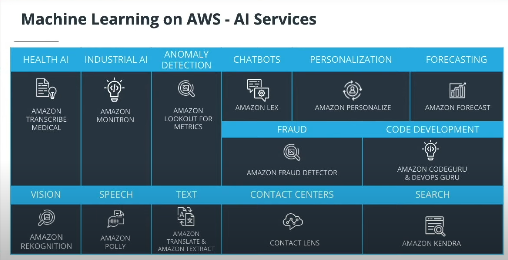
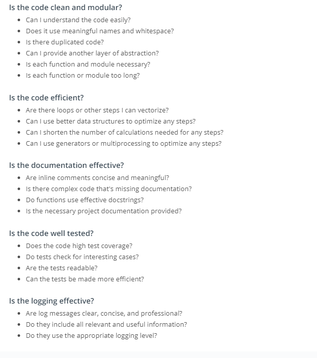

# Projects
- AWS Deep Lens - Componst:sorting-classification
- AWS Deep Racer - Reinforcement Learning (SAC and PPO)
- AWS Deep Composer - Generative AI (ARCNN,GAN,Transformers)
- Software Engineering Practices - (Refactoring Wine quality, optimizing common books, optimizing Holiday gifts, pytest, Logging, Code-Review)
- Object Oriented Programming (Gaussian Static Modular Package build, upload pipi)

# Intro ML
- AI is a technique to simulate human level intelligence
- ML will learn automatically without explicit programming by inspecting data(unsupervised patterns supervised trained data) and reinforcement (maximize reward) 
- In reinforcement learning, the algorithm figures out which actions to take in a situation to maximize a reward (in the form of a number) on the way to reaching a specific goal.
- Model training algorithms work through an interactive process where the current model iteration is analyzed to determine what changes(unsupervised patterns no need complete model in mind) can be made to get closer to the goal. Those changes are made and the iteration continues until the model is evaluated to meet the goals.
- Regression tasks involve predicting some unknown continuous attribute about your data.
- Clustering tasks involve exploring how your data might be grouped together.
- Data inspection for data integrity includes outliers,missing or incomplete, transform data etc
- Impute is a common term referring to different statistical tools which can be used to calculate missing values from your dataset.
- Split data usually for bias-variance trade-off
- Model parameters: Model parameters are settings or configurations the training algorithm can update to change how the model behaves
- Hyperparameters are settings on the model which are not changed during training but can affect how quickly or how reliably the model trains, such as the number of clusters the model should identify.(number of hidden units,learning rate-set before training optimizing weights and bias)
- Loss function measures how far model is from goal
- Classification tasks often use a strongly related logistic model, which adds an additional transformation mapping the output of the linear function to the range [0, 1], interpreted as “probability of being in the target class.
- Tree based model learns to categorize or regress by building an extremely large structure of nested if/else blocks, splitting the world into different regions at each if/else block. Training determines exactly where these splits happen and what value is assigned at each leaf region.
Neural Network model (also called a neural network) is composed of collections of neurons (very simple computational units) connected together by weights (mathematical representations of how much information to allow to flow from one neuron to the next)
- Transformer: A more modern replacement for RNN/LSTMs neural networks, the transformer architecture enables training over larger datasets involving sequences of data.
- RNN/LSTM: Recurrent Neural Networks (RNN) and the related Long Short-Term Memory (LSTM) model types are structured to effectively represent for loops in traditional computing, collecting state while iterating over some object. They can be used for processing sequences of data.

<br>


<br>
<br>

- Log loss seeks to calculate how uncertain your model is about the predictions it is generating.
- Mean absolute error (MAE): This is measured by taking the average of the absolute difference between the actual values and the predictions. Ideally, this difference is minimal.
- Root mean square error (RMSE): This is similar MAE, but takes a slightly modified approach so values with large error receive a higher penalty. RMSE takes the square root of the average squared difference between the prediction and the actual value.
- Coefficient of determination or R-squared (R^2): This measures how well-observed outcomes are actually predicted by the model, based on the proportion of total variation of outcomes.
- Ridge Regression is a popular type of regularized linear regression that includes an L2 penalty. This has the effect of shrinking the coefficients for those input variables that do not contribute much to the prediction task.
- Techniques exist to modify the data so you can still use linear models in curved graph situations are called kernel methods.
- Microgrenres in book(back of book similar words or book description text for 800 romance books) to find common words (microgenre)-clustering
- words:lowercase,punctations remove- stop words(a,the),data vectorization for bag of words and clustering to find the genre
- evaluation metrics like confusion matrix , silhouete Coefficient(how well data clustered)f1-score etc
- accuracy:You realize the model will see the 'Does not contain spill' class almost all the time, so any model that just predicts “no spill” most of the time will seem pretty accurate.
- precision as answering the question, "Of all predictions of a spill, how many were right?" and recall as answering the question, "Of all actual spills, how many did we detect?"

# AWS ML
<a href = "https://aws.amazon.com/machine-learning/ai-services/?utm_source=Udacity&utm_medium=Webpage&utm_campaign=Udacity%20AWS%20ML%20Foundations%20Course">

</a>

- Amazon sagemaker is a PAAS service to build,train and deploy machine learning models

### Computer Vision
- computer vision recognises patterns(edges-rextures-high features-deep learning) to gain understanidng of image like different rules in different positions, conditions etc to detect image
- CV applications-activity recognition, sorting, ocr, content filtering, parking, argument reality: photo apps , segmentation, recognise + where object is
- lambda function spins up the model and performs inference
- Object detection can be used to not only count the number of objects in an image (same and different) but also to identify different classes present in an image
- Activity recognition is used when we need to identify changes which occur over time in a video

### Reinforcement Learning
- Reinfocement learning what actions to take in environment to maximize reward /rech goal (training dog positive/negative)
- Play games, create right balance by making reinforcment agent play again and again -graphs
- upstream turbines slows down it helps capture more energy by downstream turbine using reinforcement learning
- industrial robots, fraud detection, stock trading, autonomous driving
- state is defined the current position within environment that is visible
- In AWS Deep racer image captured is state. and terminal(episode-initial) state is final off-track or obstacle. Feedback is given to agent as numerical feedback
- reward function is numeric assigns scores as reward to different zones in traks
- SAC (only continous state) encourage exploration (data efficent lacks stablilty) unlike Proimity Policy Optimization
- Discrete action space represents all of an agent's possible actions for each state in a finite set of steering angle and throttle value combinations.
- Continuous action space allows the agent to select an action from a range of values that you define for each sta te.
- learning rate is a hyperparameter that controls how many new experiences are counted in learning at each step.A higher learning rate results in faster training but may reduce the model’s quality
- Reward function as a grid mapped over race track in AWS Deep racer
- stero camera left and right gives depth to avoid obstacles
- generative models are unsupervised. Diiscriminating (classify) and generating (generate data learned during training-pattern or distribution etc)

### GAN
- GAN, Auto regressive models and Transformer based models
- GAN putting two neural networks against each other to generate content. Discriminator measures real/fake and gives feedback to generator to generate realistic images
- The training algorithm swaps back and forth between training a generator network (responsible for producing new data) and a discriminator network (responsible for measuring how closely the generator network’s data represents the training dataset).
- Autoregressive models are used to study systems which evolve over time. They rely on previous time series to generate accurate new data. weather prediction
- Transformer is used to study data that is sequential. pixels in image, nlp
- Use the GAN technique to create accompaniment tracks.
Use the AR-CNN technique to modify notes in your input track.
Use the transformers technique to extend your input track by up to 30 seconds.
- The discriminator then takes these generated music tracks and predicts how far they deviate from the real data present in the training dataset. This deviation is called the generator loss. This feedback from the discriminator is used by the generator to incrementally get better at creating realistic output.
- The generator and the discriminator are trained in alternating cycles. The generator learns to produce more and more realistic data while the discriminator iteratively gets better at learning to differentiate real data from the newly created data.
- Generator loss: Measures how far the output data deviates from the real data present in the training dataset.
Discriminator loss: Evaluates how well the discriminator differentiates between real and fake data.
- Autoregressive convolutional neural networks make iterative changes over time to create new data.. AR-CNN used to edit/correct music
- Loss models stabilize helps that no more training can be done

# Software Engineering Fundamentals
- Clean(simple,readable,concise) and Modular Code. Abstracting improves readiblity of code
- Modular code is logically broken up into functions and modules (file encapsulating code).
- Refactoring/restructing after making the code work is best practice/speeds up/ maintain/reuse etc
- meaningful descriptive names, DRY(dont repeat yourself using functions,modules), 
- type in variable name,is_minor - paths of speech to represent,be descriptive but not many characters,implementation details are unnecessary to include in variable,fix the weight spaces - indentation, seperate code with blank lines
- renaming like is_female and functions categorize_task instead of category better and variable as simply category etc
-  the standard is to use four spaces for each indent.Try to limit your lines to around 79 characters, which is the guideline given in the PEP 8 style
- each function should do only one thing .try to refactory and reduce reusability. otherwise more difficult to generalize
- Efficiency in code : time and space tradeoff. when refactoring efficiency should also be improved
- vector operations like numpy-pandas  instead of loops. know your data structures and which methods are faster 
- Inline comments - line level #.
Docstrings - module and function level  """ after function def""".
Project documentation - project level such as Readme.md .
- Refactoring argument instead of comments. Sometimes an unconventional or seemingly arbitrary approach may be applied because of some obscure external variable causing side effects. These things are difficult to explain with code.
- doc string first line detailed explaination,args,returns
- Project Documentation  should explain what it does, list its dependencies, and provide sufficiently detailed instructions on how to use it.
- git log and check cross validation score  for given paramaters then checkout commit and merge to develop. git merge --no-ff friend_groups
- Mlops require large dataset-model unlike devops. dvc: handles large dataset and model artifact. Data Version Control (DVC) is a Git extension that adds functionality for managing your code and data together.
- It is the model metadata that can lead us to the real model object which is stored in backend storage. To prevent from losing the metadata, it should be added to version control using git.
- Testing in datascience is b ad encoding,inappropriate,unepxceted features are not easily detectable
- Test Driven development is writing tests before developing code to implement tasks
- Unit test: A type of test that covers a “unit” of code—usually a single function—independently from the rest of the program. Larger Programs we use integration tests as well
- pytest the functions start with test_ and functions test_ then assert
- Enter pytest into your terminal in the directory of your test file and it detects these tests for you. Will stop only if errors not failed asserts
- Test driven development helps if we succeded in finishing task though initially fails
- Tests also helps ensure that your function behavior is repeatable, regardless of external parameters such as hardware and time.
- Logging is valuable for understanding the events that occur while running your program.especially you cant monitor everything real time
- Debug: Use this level for anything that happens in the program. 
Error: Use this level to record any error that occurs. 
Info: Use this level to record all actions that are user driven or system specific, such as regularly scheduled operations.
- Code Review helps catch erors,readability,standards are met, share knowledege on teams (code style exisitng check etc)
- comments should be like Understand your thought process while reviewing.
- Keep your comments objective like avoiding I and you . Provide code examples


# Object Oriented Programming
- Hides implementation, allows to create large modular programs
- Procedural Programming executes instructions one at a time
- Object oriented programming focuses on each of characterstics of object(an instance of class) and actions of object.  A characteristic (**attributes**) corresponds to a noun and an action(**methods**) corresponds to a verb.
- method is inside of a class whereas a function is outside of a class.
- Blueprint - **CLASS** which has same generic method,attributes


- Encapsulation: One of the fundamental ideas behind object-oriented programming is called encapsulation: you can combine functions and data all into a single entity. In object-oriented programming, this single entity is called a class
- Camel case for class name is good practice
- __init__ is used to initialize,create specific object. self is like dictionary which holds all of the values
- Note the return and non return for a particular method. Can access using '.' syntax
```
class Shirt:

    def __init__(self, shirt_color, shirt_size, shirt_style, shirt_price):
        self.color = shirt_color
        self.size = shirt_size
        self.style = shirt_style
        self.price = shirt_price
    
    def change_price(self, new_price):
    
        self.price = new_price
        
    def discount(self, discount):

        return self.price * (1 - discount)
```

- **Self** tells (differentiates between two instance objects of class) Python where to look in the computer's memory for the shirt_one object
- The word self (implicit) is just a convention. You could actually use any other name as long as you are consisten, but you should use self to avoid confusing people.
- Python does not have an option to change values attributes directly unlike c++ etc (protected).  price could be explicitly labeled as a **private variable**. This would prohibit an object from accessing the price attribute directly like shirt_one._price = 15.
- the general object-oriented programming convention  is to use **Methods** use to change values for example dollars to euros. Multiply by a factor instead of manually entering. These methods are called set and get methods or setter and getter methods
-Binomial Distrivution: A fair coin has a probability of a positive outcome (heads) p = 0.5. If you flip a coin 20 times, the mean would be 20 * 0.5 = 10; you'd expect to get 10 heads.  the standard deviation is the square root of the variance. probability density function
- 


