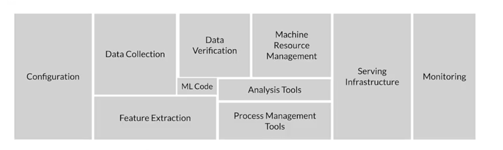

# About
- Mlops is an iterative process. ML development + Modern Software Development 
- automation for consistency, replicability etc
- Data drift and Concept drift
- Rare conditions important health care etc
- Feature space coverage in training(equal weights)
- HLP and data ambiguity

### Data in Production Environment
- Data is the most important for sucessful machine learning cycle in production

- Ml pipeline is automating,monitoring,maintaining the Ml flow from training to deployment. Almost DAG's
- Airflow,kubeflow,TFX etc are some orchestraction ml pipeline frameworks
- In production ML The design priorities for production ML are fast inference and good interpretability.
- ML pipeline workflows are almost always DAGs.
- In ML, data are first-class citizens.Data are entities that support all operations generally available to other entities.
- Human raters performing labeling are generalists,subject matter experts, users using the model
- Gradual : data changes(trend and seasonality,distrubtuion and relation importance of feature changes)
- Gradual:  world changes(style changes, scope and process,competitor,business)
- Sudden : bad sensor,log,moved-disabled cameras
- system : network connectivity,bad software update,bad crendentials, system down
- click through rate as proxy which form how much inventory shoes to order
- process feedback(direct labeling-inference-monitor-reinforcement labels) : actual vs predicted click through rates (positive,negative). logstash,fluentd
- weak supervision : programmatic way of creating labels
- data drift (cchanges over time) skew (difference between static version such as training and serving sources)
- concept drift mapping (world changes ground truth -trend,style housing prices per sqm etc) labels meaning change
- schema skew different data types, distriubtion,continous evaluation 
