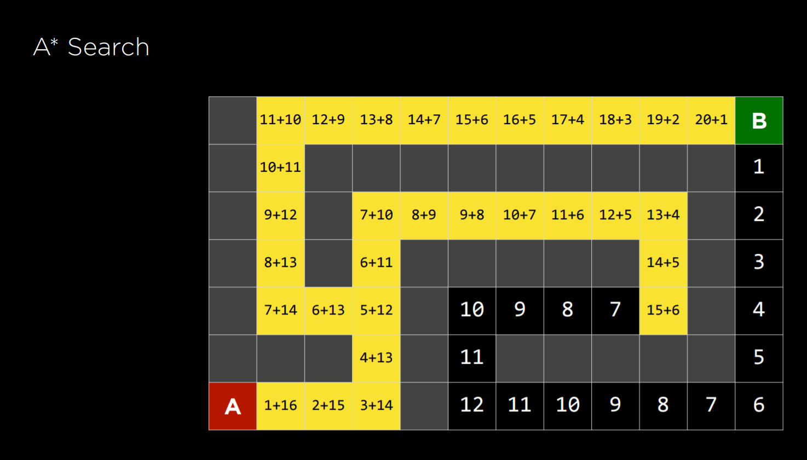
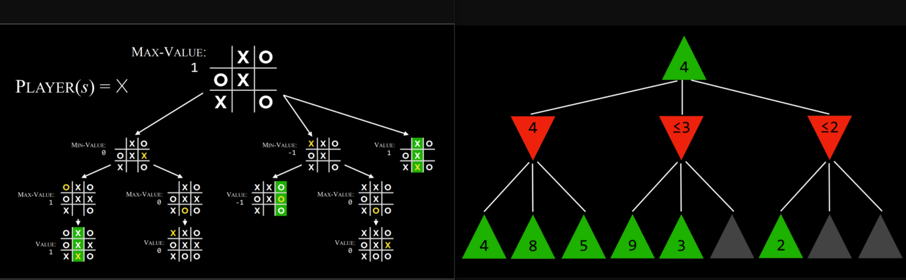

# About
## Search
- Finding a solution to a problem, like a navigator app that finds the best route from your origin to the destination, or like playing a game and figuring out the next move.

## Knowledge
- Representing information and drawing inferences from it.

## Uncertainty
- Dealing with uncertain events using probability.

## Optimization
- Finding not only a correct way to solve a problem, but a better—or the best—way to solve it.

## Learning
- Improving performance based on access to data and experience. For example, your email is able to distinguish spam from non-spam mail based on past experience.

## Neural Networks
- A program structure inspired by the human brain that is able to perform tasks effectively.

## Language
- Processing natural language, which is produced and understood by humans.

# Search Problems/Algorithms
- Search problems involve an agent that is given an initial state and a goal state, and it returns a solution of how to get from the former to the latter
- Puzzle, Maze,playing a game Google-Maps etc are examples of search problem
- State is configuration of agent in an  environment, An agent is an entity that precieves and acts on enviornment.
- actions can be defined as a function. Upon receiving state s as input, Actions(s) returns as output the set of actions that can be executed in state s.
- transition model can be defined as a function. Upon receiving state s and action a as input, Results(s, a) returns the state resulting from performing action a in state s
- State space is the set of all states reachable from the initial state by any sequence of actions
- **Uninformed** Search usually large time: DFS (Stack- LIFO) goes deep and BFS(Que- FIFO) shallow close to node/junction etc - more memory shortest path 
- **Informed** Search: Greedy best first search : Closest to goal first explored : estimated Heustric function like manyhaten shortest distance given co-ordinates : Not optimal (find shortest path)
- A* Search : cost(how many steps to current postition) and estimated(how far away from goal) to reach goal. g(n)+h(n)

- a-star is Optimal if h(n) is admissable (never overstimate to true consistant) and consistent (h(n)<=h(n')+c>)
- **Adversial** search(tic-tac-toe) is two way unlike other searches above where one want to succed the other want us to fail
- Minmax: Max(X) wants to maximize score and Min(O) aims to minimize the score
- Tic-tac: Player- returns which player to move in state s- Player(s or X)=O, action: returns legal moves in state s Actions(S) = {possible placements states of all}, result(s,a) returns state after action a taken in state S, terminal for over or not by taking state input and utility(s) final numerical value of terminal state s. Recurssive
- Alpha-Beta Pruning is  Optimal (REd-min and green-max) choose max state among min for 2 deeper levels etc by Book-keeping

- Depth-Limited Minimax only limited moves ahead to check. If no terminal state the evaulation function: the expected utility of game. How better the state is. In chess -pieces values etc
- 